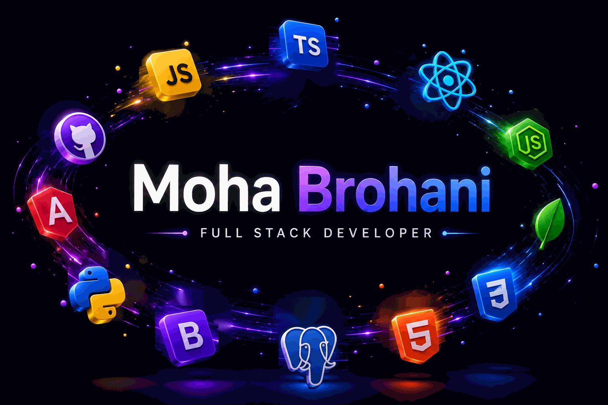

  

### Fullstack Developer

I build modern web applications with Angular, TypeScript, Django REST Framework, and Python while continuously expanding my skills in frontend, backend, and deployment.

## 🛠 Tech Stack

  

## 💡 Core Skills

- REST API Development
- JWT Authentication
- Clean Code
- Software Architecture
- CI/CD
- Object-Oriented Programming (OOP)
- Responsive Web Design
- Deployment with Gunicorn & Nginx

## 🚀 Featured Projects

### • Coderr
Angular • Django REST Framework • PostgreSQL

**Live Demo:** [Coderr](https://coderr.mohabroha.dev/) · **GitHub:** [Repository](https://github.com/MohaBroha/coderr-project)

### • Quizly
Angular • Django REST Framework • AI Integration

**Live Demo:** [Quizly](https://quizly.mohabroha.dev/) · **GitHub:** [Repository](https://github.com/MohaBroha/Quizly-project)

### • Join
Angular • TypeScript • Supabase

**Live Demo:** [Join](https://join.mohabroha.dev/#/login) · **GitHub:** [Repository](https://github.com/MohaBroha/Join)

### • KanMind
HTML • CSS • JavaScript • REST API

**Live Demo:** [KanMind](https://kanmind.mohabroha.dev/pages/auth/login.html) · **GitHub:** [Repository](https://github.com/MohaBroha/kanmind-project)

### • El Pollo Loco
JavaScript • OOP • Canvas

**Live Demo:** [El Pollo Loco](https://elpollo.mohabroha.dev/) · **GitHub:** [Repository](https://github.com/MohaBroha/El-Pollo-Loco-Project)

### • Portfolio
Angular • TypeScript • Responsive Design

**Live Demo:** [Portfolio](https://mohabroha.dev/) · **GitHub:** [Repository](https://github.com/MohaBroha/portfolio-angular)

## 💼 Experience

• Fullstack Web Development
• REST API Development
• Authentication & Authorization (JWT)
• PostgreSQL Database Design
• Linux Server Administration
• Deployment with Gunicorn & Nginx
• Cloudflare DNS & SSL
• Git & GitHub Workflow

## 📫 Connect

Email: mohabroha@mail.de
LinkedIn: https://www.linkedin.com/in/moha-brohani-aa34233b0/
